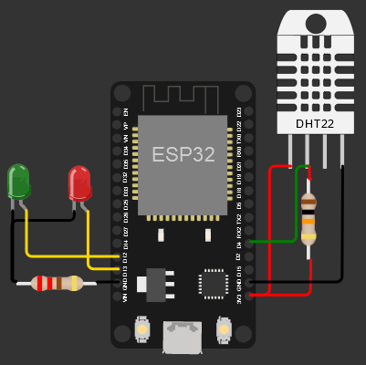
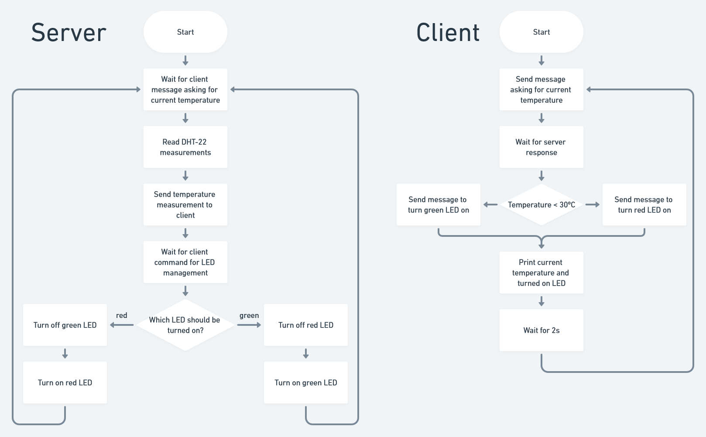

# ESP32 WebSocket temperature monitor

This project implements a WebSocket server inside a WiFi network provided via ESP32 access point. With the appropriate (and very polite) messages, it will respond with the current temperature readings and turn on/off a green and a red LEDs every 2s (somewhat arbitrary time, but long enough for the DHT readings to work).
It was done as a project for the Distributed & Real Time Systems class from Unisinos' Computer Engineering course, as an exercise of defining and implementing a tiny protocol. As per initial definition, the current protocol doesn't have an acknowledgement (ACK) and retry mechanism, making it very fragile. A good exercise would be implementing it accordingly.

## Technologies used

- [ESP32 Microcontroller](https://www.espressif.com/en/products/socs/esp32) (I use ESP32 DEVKIT V1, but anyone must do)
- DHT22 Temperature and Humidity Sensor (or any other compatible device)
- [WebSockets](https://developer.mozilla.org/pt-BR/docs/Web/API/WebSocket)
- [AsyncTCP](https://github.com/me-no-dev/AsyncTCP/) and [ESPAsyncWebServer](https://github.com/me-no-dev/ESPAsyncWebServer/) (for non-blocking WiFi and WebSocket server)

## Dependencies

There are a few external dependencies to be installed:

- DHT-22: Open the Arduino IDE's `Library Manager` (`Tools` > `Manage Libraries...`) and install `Adafruit Unified Sensor` and `DHT sensor library` libraries
- AsyncTCP and ESPAsyncWebServer: Download the libraries' ZIP files from Github ([AsyncTCP](https://github.com/me-no-dev/AsyncTCP/archive/master.zip), [ESPAsyncWebServer](https://github.com/me-no-dev/ESPAsyncWebServer/archive/master.zip)), then add them through Arduino IDE (`Sketch` > `Include Library` > `Add .ZIP Library...`)

## Connections diagram

## Flowcharts

Flowchart made on the awesome [Whimsical](https://whimsical.com/) tool.

## Credits

This project was a stitch from various tutorials I've found. For the ESP32 as a WebSocket server, I was backed up by [this tutorial](https://randomnerdtutorials.com/esp32-websocket-server-arduino/). For the Access Point, [this tutorial](https://randomnerdtutorials.com/esp32-access-point-ap-web-server/) made the trick. The temperature measurement I've found on [this tutorial](https://randomnerdtutorials.com/esp32-dht11-dht22-temperature-humidity-sensor-arduino-ide/), and so I must give huge thanks to the [Random Nerd Tutorials](https://randomnerdtutorials.com/) team.
